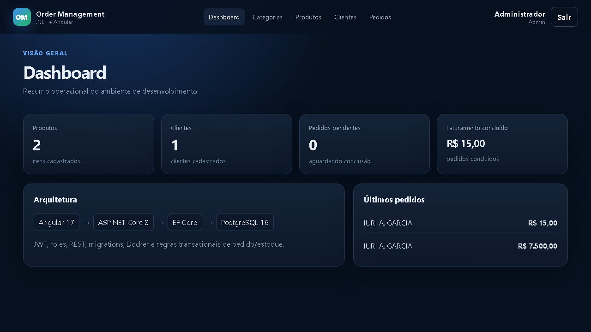
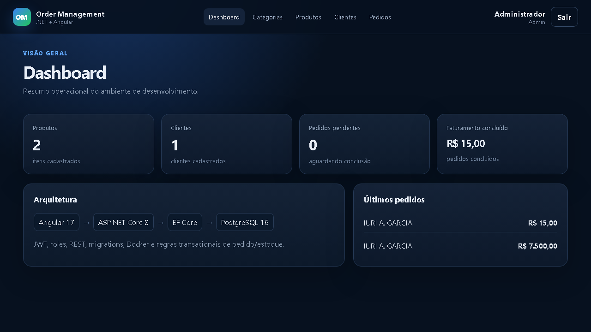
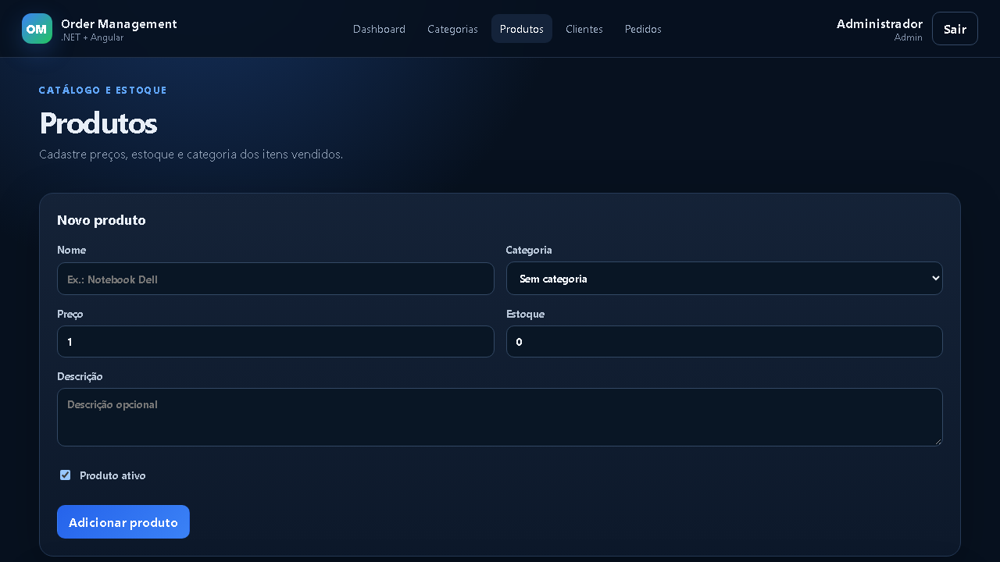
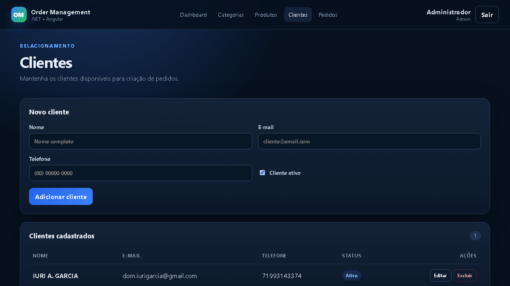
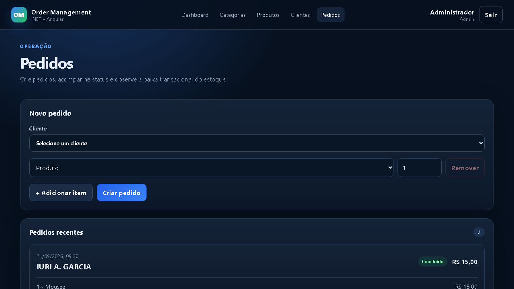

# Order Management — .NET 8 + Angular 17

[](https://github.com/domgaga79/order-management-dotnet-angular/actions/workflows/ci.yml)

Sistema full stack para gerenciamento de pedidos, clientes, produtos, categorias e estoque, desenvolvido como projeto de estudo e portfólio com foco em práticas aplicáveis a sistemas corporativos.

## Demonstração

> As imagens abaixo são capturadas da aplicação local real. Para gerar/atualizar os arquivos, execute `.\scripts\capture-portfolio.ps1` com backend e frontend em execução.

<p align="center">
  
</p>

| Dashboard | Produtos |
|---|---|
|  |  |

| Clientes | Pedidos |
|---|---|
|  |  |

## Visão geral

A aplicação possui frontend em Angular 17 e API REST em ASP.NET Core/.NET 8. O backend utiliza Entity Framework Core com PostgreSQL, autenticação JWT, autorização por roles e transações para proteger regras de estoque e pedidos.

### Principais funcionalidades

- Autenticação com JWT.
- Perfis de acesso `Admin` e `Operator`.
- CRUD de categorias.
- CRUD de produtos com preço, estoque, status e categoria.
- CRUD de clientes.
- Criação de pedidos com múltiplos itens.
- Snapshot do preço do produto no item do pedido.
- Baixa automática de estoque ao criar pedido.
- Validação de estoque insuficiente.
- Bloqueio pessimista com `FOR UPDATE` nas operações críticas.
- Cancelamento de pedido com restauração do estoque.
- Conclusão de pedido.
- Dashboard com indicadores operacionais.
- Swagger/OpenAPI com suporte a Bearer Token.
- Docker Compose para PostgreSQL.
- Testes unitários e de integração com xUnit.
- PostgreSQL descartável nos testes de integração via Testcontainers.
- Cobertura coletada no GitHub Actions.
- Pipeline de CI para backend e frontend.

## Arquitetura

```text
Angular 17
    |
    | HTTP / JSON / JWT
    v
ASP.NET Core Web API
    |
    +--> Controllers
    |       |
    |       v
    |    Services
    |       |
    |       v
    | Repository / EF Core
    |       |
    v       v
 PostgreSQL 16
```

A solução .NET está organizada em:

```text
backend/
├── OrderManagement.Api
├── OrderManagement.Application
├── OrderManagement.Domain
├── OrderManagement.Infrastructure
└── OrderManagement.Tests
```

| Projeto | Responsabilidade |
|---|---|
| `OrderManagement.Api` | Controllers, autenticação, Swagger, DI e configuração HTTP |
| `OrderManagement.Application` | DTOs, interfaces e serviços de aplicação |
| `OrderManagement.Domain` | Entidades e enums do domínio |
| `OrderManagement.Infrastructure` | EF Core, PostgreSQL, repositories e serviços de persistência |
| `OrderManagement.Tests` | Testes unitários e de integração |

Mais detalhes em [`docs/ARCHITECTURE.md`](docs/ARCHITECTURE.md).

## Tecnologias

### Backend

- C#
- .NET 8
- ASP.NET Core Web API
- Entity Framework Core 8
- Npgsql
- PostgreSQL 16
- JWT Bearer Authentication
- BCrypt
- Swagger / OpenAPI
- xUnit
- Testcontainers.PostgreSql
- Coverlet

### Frontend

- Angular 17
- TypeScript
- Angular Router
- HttpClient
- RxJS
- Guards e Interceptors

### DevOps

- Docker / Docker Compose
- Git / GitHub
- GitHub Actions

## Regras de negócio importantes

### Criação do pedido

Ao criar um pedido, a aplicação:

1. valida o cliente;
2. agrupa itens repetidos do mesmo produto;
3. inicia uma transação;
4. bloqueia o registro do produto com `FOR UPDATE`;
5. recarrega o estoque dentro da transação;
6. valida a quantidade disponível;
7. reduz o estoque;
8. salva `UnitPrice` e `Subtotal` no item do pedido;
9. calcula o total;
10. persiste o pedido e confirma a transação.

Isso reduz o risco de duas requisições concorrentes venderem o mesmo estoque disponível.

### Cancelamento

Pedidos pendentes podem ser cancelados e suas quantidades são devolvidas ao estoque dentro de uma transação. O cancelamento repetido é idempotente e não devolve estoque duas vezes. Pedidos concluídos não podem ser cancelados.

### Histórico de preço

O item do pedido possui `UnitPrice`, preservando o preço aplicado no momento da venda mesmo que o preço atual do produto seja alterado posteriormente.

## Como executar

### Pré-requisitos

- .NET SDK 8
- Docker Desktop
- Node.js
- npm

### Banco

```powershell
docker compose up -d
```

### Backend

```powershell
dotnet restore
dotnet build
dotnet run --project backend\OrderManagement.Api
```

Swagger:

```text
http://localhost:5294/swagger
```

### Frontend

```powershell
cd frontend\order-management-web
npm install
npm start
```

Frontend:

```text
http://localhost:4200
```

### Atalho

```powershell
.\start-dev.ps1
```

Para encerrar:

```powershell
.\stop-dev.ps1
```

## Usuário local de demonstração

```text
E-mail: admin@local.test
Senha:  Admin123!
```

> Credencial exclusiva para desenvolvimento local.

## Endpoints principais

```text
POST   /api/auth/login
POST   /api/auth/register

GET    /api/categories
POST   /api/categories
PUT    /api/categories/{id}
DELETE /api/categories/{id}

GET    /api/products
POST   /api/products
GET    /api/products/{id}
PUT    /api/products/{id}
DELETE /api/products/{id}

GET    /api/customers
POST   /api/customers
PUT    /api/customers/{id}
DELETE /api/customers/{id}

GET    /api/orders
GET    /api/orders/{id}
POST   /api/orders
PUT    /api/orders/{id}/complete
PUT    /api/orders/{id}/cancel
```

## Testes automatizados

```powershell
dotnet test
```

A suíte cobre 20 cenários:

```text
ProductService
├── criação e normalização
├── mapeamento
├── busca
├── atualização
└── exclusão

OrderService + PostgreSQL real
├── baixa de estoque
├── snapshot de preço
├── agrupamento de itens repetidos
├── rollback por estoque insuficiente
├── cliente inativo
├── cancelamento/restauração idempotente
└── regras de conclusão/cancelamento

AuthService + PostgreSQL real
├── primeiro Admin
├── usuários seguintes como Operator
├── e-mail duplicado
├── login válido
├── senha inválida
└── usuário inativo
```

Os testes de integração utilizam `Testcontainers.PostgreSql`, portanto sobem um PostgreSQL 16 descartável e validam transações e SQL real em vez de depender de um provider em memória.

> Docker precisa estar ativo para executar a suíte de integração localmente.

### Cobertura

O workflow coleta cobertura com Coverlet e publica `coverage.cobertura.xml` como artefato do GitHub Actions.

## Gerar screenshots e GIF do portfólio

Com a aplicação rodando:

```powershell
.\scripts\capture-portfolio.ps1
```

O script instala temporariamente Playwright e as bibliotecas necessárias sem alterar `package.json`/`package-lock.json`, captura as telas e gera:

```text
docs/screenshots/
├── 01-dashboard.png
├── 02-categories.png
├── 03-products.png
├── 04-customers.png
├── 05-orders.png
└── order-flow.gif
```

## CI

`.github/workflows/ci.yml` valida:

```text
Backend
restore -> build -> testes + cobertura

Frontend
npm ci -> Angular build
```

## Pontos técnicos para entrevista

- Dependency Injection e lifetimes.
- `async/await` e `Task`.
- DTOs e separação de responsabilidades.
- EF Core, migrations e Change Tracking.
- LINQ e `AsNoTracking`.
- JWT e RBAC.
- transações ACID.
- concorrência e `FOR UPDATE`.
- rollback e idempotência.
- unit tests x integration tests.
- Testcontainers com PostgreSQL real.
- Angular services, guards e interceptors.
- Docker e GitHub Actions.

Roteiro: [`docs/INTERVIEW.md`](docs/INTERVIEW.md).

## Próximas evoluções

- testes HTTP end-to-end com `WebApplicationFactory`;
- cenários de concorrência simultânea;
- paginação e filtros server-side;
- refresh token;
- auditoria;
- observabilidade e logs estruturados;
- secrets fora do `appsettings.json`;
- deploy automatizado.

---

Projeto desenvolvido para aprofundar práticas de desenvolvimento full stack com .NET e Angular, aplicando APIs REST, regras transacionais, persistência relacional, testes automatizados e arquitetura de aplicações corporativas.
